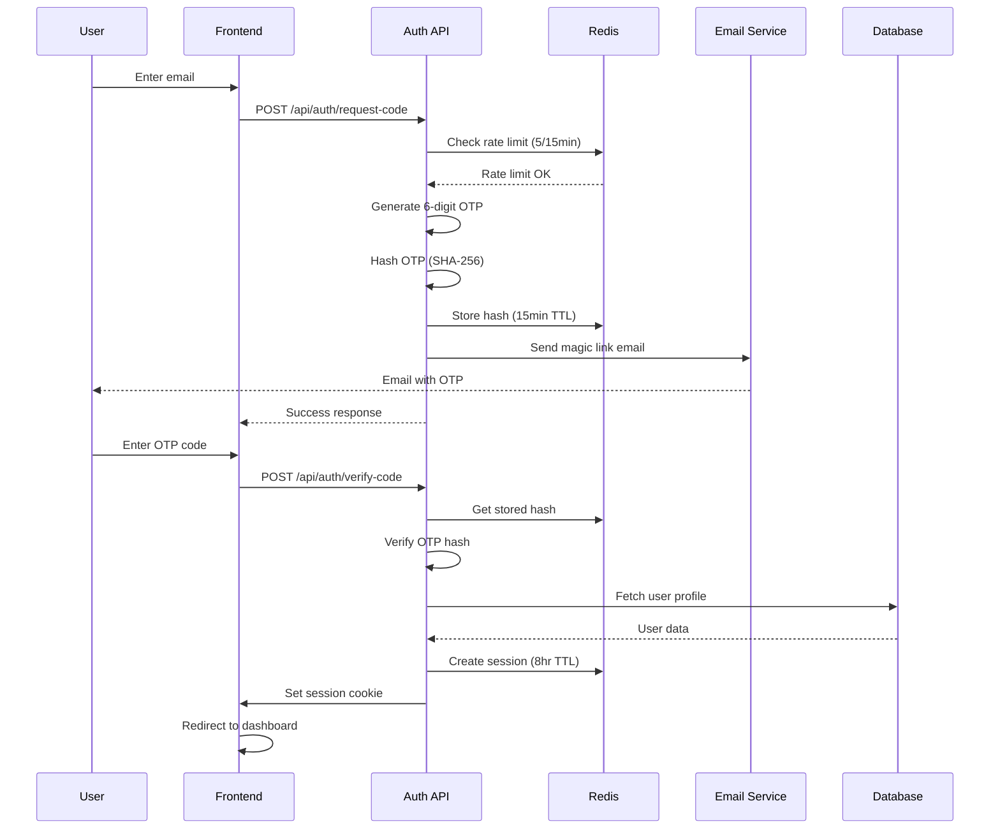
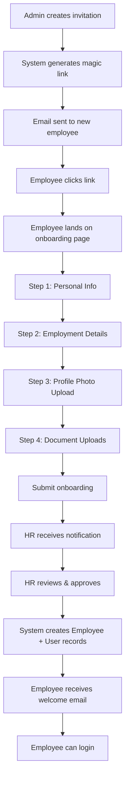
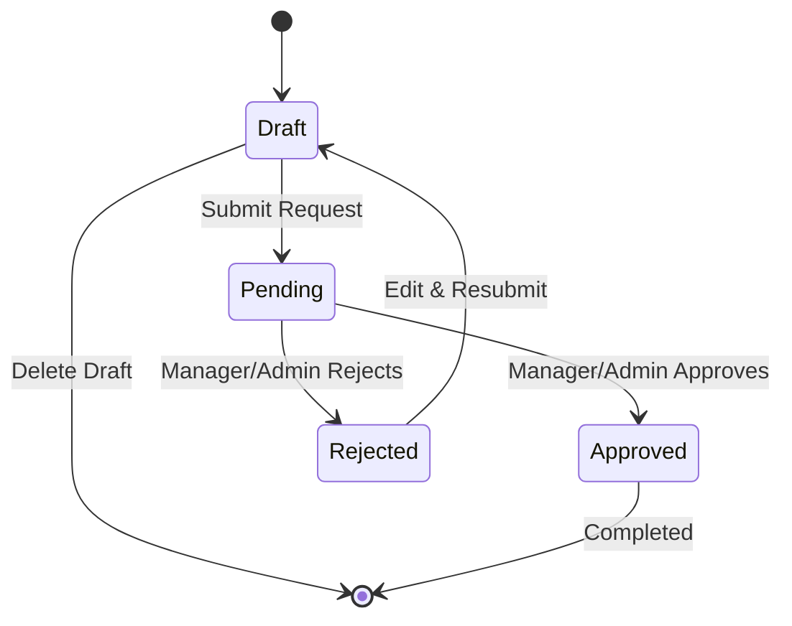
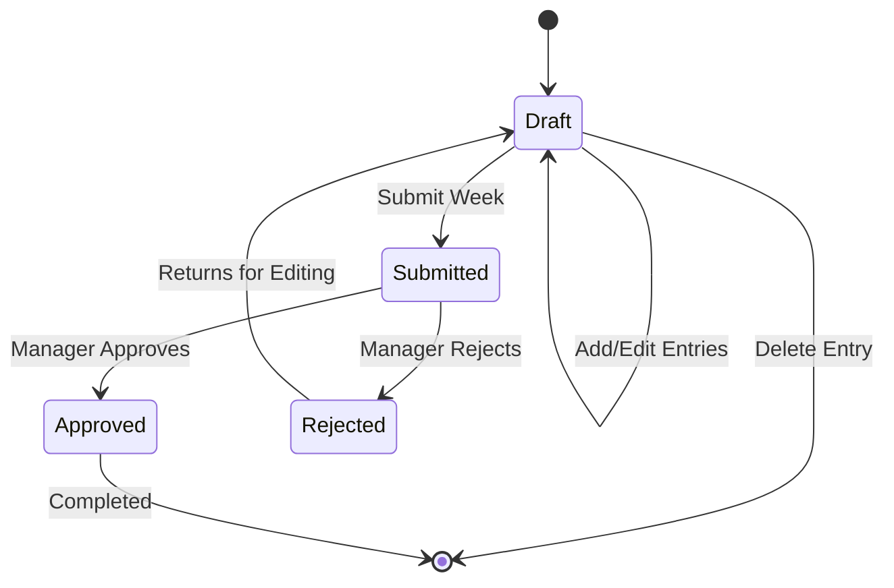
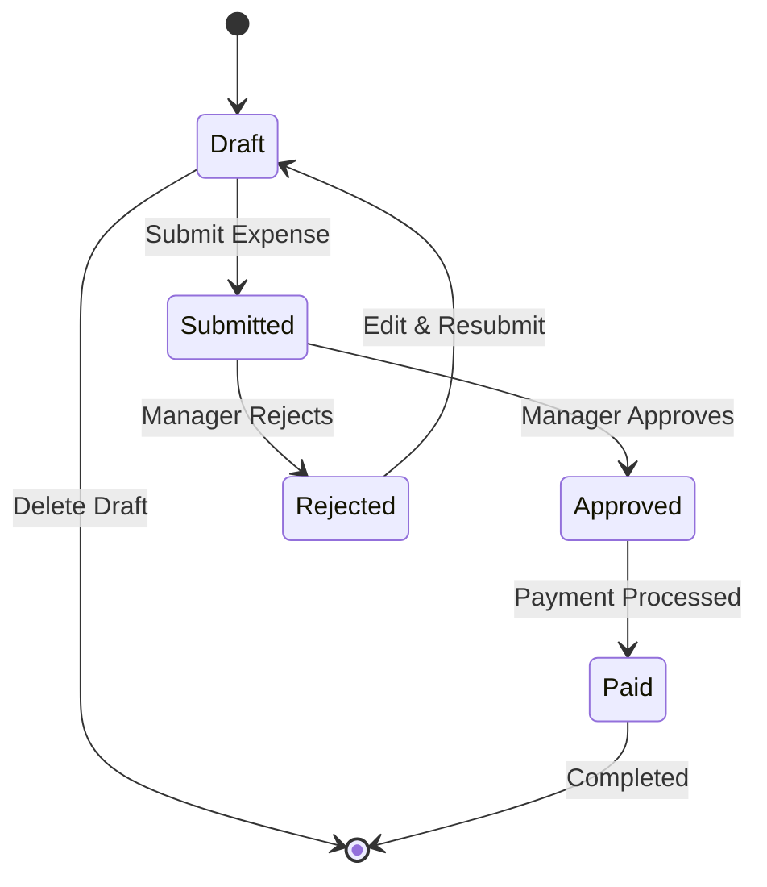

# Zenora.ai - Complete System Flows Documentation

**Version:** 1.0
**Date:** December 21, 2025
**Platform:** Employee Management SaaS
**Tech Stack:** Next.js 15, React 19, Prisma, PostgreSQL

---

## Table of Contents

1. [Authentication Flows](#authentication-flows)
2. [Employee Onboarding Flow](#employee-onboarding-flow)
3. [Leave Management Flow](#leave-management-flow)
4. [Timesheet Management Flow](#timesheet-management-flow)
5. [Expense Management Flow](#expense-management-flow)
6. [Project Management Flow](#project-management-flow)
7. [Meeting Management Flow](#meeting-management-flow)
8. [Performance Review Flow](#performance-review-flow)
9. [Invoice & Billing Flow](#invoice-billing-flow)
10. [Payroll Processing Flow](#payroll-processing-flow)
11. [Client Onboarding Flow](#client-onboarding-flow)
12. [Team Management Flow](#team-management-flow)

---

## 1. Authentication Flows

### 1.1 Passwordless Login Flow (Magic Link)

**Entry Point:** `/auth/login`



**Steps:**

1. **Request OTP Code**
   - **Endpoint:** `POST /api/auth/request-code`
   - **Input:** `{ email: string }`
   - **Validation:**
     - Email format validation
     - Rate limiting (5 requests per 15 minutes)
     - User existence check
   - **Process:**
     - Generate cryptographically secure 6-digit code
     - Hash code with SHA-256
     - Store hash in Redis with 15-minute expiration
     - Send email with magic link
   - **Output:** `{ success: true, message: "Code sent" }`

2. **Verify OTP Code**
   - **Endpoint:** `POST /api/auth/verify-code`
   - **Input:** `{ email: string, code: string }`
   - **Validation:**
     - Rate limiting (5 attempts per 15 minutes)
     - Code format validation
     - Hash comparison
   - **Process:**
     - Retrieve stored hash from Redis
     - Verify code hash matches
     - Create user session (8-hour TTL)
     - Set HTTP-only secure cookie
     - Track device fingerprint and IP
   - **Output:** `{ success: true, user: {...} }`
   - **Redirect:** Role-based dashboard

3. **Session Validation (Every Request)**
   - **Middleware:** Next.js middleware
   - **Process:**
     - Extract session cookie
     - Validate session in Redis
     - Check session expiration
     - Load user profile
     - Verify tenant membership
   - **Authorization:** RBAC check for route

---

### 1.2 Super Admin Login Flow

**Entry Point:** `/super-admin/login`

```
User Input Email → Verify @zenora.ai domain → Request OTP →
Verify Code → Create Super Admin Session → Redirect to /super-admin/dashboard
```

**Key Differences:**
- Email domain restriction: `@zenora.ai` only
- No tenant assignment
- Platform-wide permissions
- Separate session namespace

---

### 1.3 Logout Flow

**Endpoint:** `POST /api/auth/logout`

```
User Click Logout → Delete session from Redis →
Clear session cookie → Redirect to /auth/login
```

**Process:**
1. Extract session ID from cookie
2. Delete session from Redis
3. Clear `session` cookie
4. Clear `tenantId` cookie
5. Return success response
6. Redirect to login page

---

## 2. Employee Onboarding Flow

### 2.1 Admin-Initiated Onboarding

**Entry Point:** `/admin/employees/new`



**Detailed Steps:**

#### Step 1: Admin Creates Invitation
- **Page:** `/admin/employees/new`
- **API:** `POST /api/hr/onboarding/invite`
- **Input:**
  ```json
  {
    "email": "john.doe@example.com",
    "firstName": "John",
    "lastName": "Doe",
    "departmentId": "dept-123",
    "managerId": "mgr-456",
    "role": "EMPLOYEE",
    "jobTitle": "Software Engineer",
    "startDate": "2025-01-15"
  }
  ```
- **Process:**
  1. Validate email uniqueness
  2. Generate secure magic link token
  3. Create `OnboardingInvite` record
  4. Send invitation email
- **Output:** Invitation created, email sent

#### Step 2: Employee Receives Invitation
- **Email Template:** "Welcome to [Company Name]"
- **Content:**
  - Personalized greeting
  - Magic link (valid 7 days)
  - What to prepare (ID, documents)
  - Contact info for help
- **Link Format:** `https://zenora.ai/onboarding?token={secure_token}`

#### Step 3: Employee Clicks Magic Link
- **Page:** `/onboarding?token={token}`
- **API:** `GET /api/hr/onboarding/validate-token?token={token}`
- **Validation:**
  - Token exists
  - Not expired (7 days)
  - Not already used
  - Tenant active
- **Result:** Redirect to onboarding form or error page

#### Step 4: Multi-Step Onboarding Form

**Step 4.1: Personal Information**
- Full name (pre-filled from invitation)
- Date of birth
- Gender
- Phone number
- Address (street, city, state, zip)
- Emergency contact (name, relation, phone)
- Blood type (optional)

**Step 4.2: Employment Details**
- Employee ID (auto-generated or manual)
- Department (pre-filled)
- Manager (pre-filled)
- Job title (pre-filled)
- Start date (pre-filled)
- Employment type (Full-time, Part-time, Contract)
- Work location (Remote, Office, Hybrid)
- Probation period (months)
- Salary information
- Bank account details (for payroll)

**Step 4.3: Profile Photo**
- Upload photo (optional)
- Crop and resize
- Store in AWS S3
- Generate thumbnail

**Step 4.4: Document Uploads**
- Resume/CV
- ID proof (passport, driver's license)
- Educational certificates
- Previous employment letters
- Any additional documents
- All stored in S3 with encryption

#### Step 5: Submit Onboarding
- **API:** `POST /api/hr/onboarding/submit`
- **Process:**
  1. Validate all required fields
  2. Upload documents to S3
  3. Update `OnboardingInvite` status to `PENDING_REVIEW`
  4. Notify HR via email
  5. Send confirmation to employee
- **Email to HR:** "New onboarding submission from {name}"
- **Email to Employee:** "Thank you for submitting"

#### Step 6: HR Review
- **Page:** `/hr/onboarding`
- **API:** `GET /api/hr/onboarding/pending`
- **HR Actions:**
  - Review all submitted information
  - Verify uploaded documents
  - Request changes if needed
  - Approve or reject

**If Changes Needed:**
- **API:** `POST /api/hr/onboarding/{id}/request-changes`
- **Input:** `{ comments: string }`
- **Process:** Email employee with requested changes
- **Employee:** Can edit and resubmit

**If Approved:**
- **API:** `POST /api/hr/onboarding/{id}/approve`
- **Process:**
  1. Create `User` record with role
  2. Create `Employee` record with all details
  3. Create `EmployeeProfile` with extended info
  4. Link to department and manager
  5. Initialize `LeaveBalance` records
  6. Send welcome email with credentials
  7. Update `OnboardingInvite` status to `APPROVED`

#### Step 7: Employee Activation
- **Welcome Email:** Contains login instructions
- **Employee:** Can now login using email
- **First Login:** Redirected to employee dashboard
- **Profile:** Shows all onboarding data

---

### 2.2 HR-Initiated Quick Add

**Entry Point:** `/hr/employees/quick-add`

**Use Case:** For walk-in employees or urgent additions

**Process:**
1. HR fills minimal form (name, email, role, department)
2. System creates User + Employee immediately
3. Status: `ACTIVE` (no review needed)
4. Employee receives welcome email
5. Employee can complete profile later

**API:** `POST /api/hr/employees/quick-add`

---

### 2.3 Bulk Employee Import

**Entry Point:** `/admin/system-users/import`

**Process:**

1. **Download CSV Template**
   - **Endpoint:** `/api/admin/system-users/template`
   - **Template Columns:**
     - firstName, lastName, email, role
     - departmentId, managerId, jobTitle
     - employeeId, startDate, salary

2. **Upload CSV File**
   - **Endpoint:** `POST /api/admin/system-users/import`
   - **Validation:**
     - CSV format check
     - Required fields present
     - Email uniqueness
     - Department/manager existence
     - Role validity

3. **Processing**
   - Parse CSV row by row
   - Create User records
   - Create Employee records
   - Link to departments/managers
   - Initialize leave balances
   - Send welcome emails

4. **Results Report**
   - Successful imports: X
   - Failed imports: Y (with reasons)
   - Download error log CSV

---

## 3. Leave Management Flow

### 3.1 Employee Leave Request Flow

**Entry Point:** `/employee/leave` or `/manager/leave` or `/admin/leave`



**Detailed Steps:**

#### Step 1: Create Leave Request (Draft)
- **Page:** `/employee/leave`
- **API:** `POST /api/employee/leave`
- **Input:**
  ```json
  {
    "leaveType": "ANNUAL_LEAVE",
    "startDate": "2025-01-20",
    "endDate": "2025-01-22",
    "days": 3,
    "reason": "Family vacation"
  }
  ```
- **Validation:**
  - Start date < End date
  - Days calculation correct
  - Sufficient leave balance
  - No overlapping leave requests
  - Not in blackout period
- **Process:**
  1. Create `LeaveRequest` with status `DRAFT`
  2. No email notification yet
  3. Can edit or delete draft
- **Output:** Draft leave request saved

#### Step 2: Submit Leave Request
- **API:** `POST /api/employee/leave/submit`
- **Input:** `{ leaveRequestId: "uuid" }`
- **Process:**
  1. Validate leave request still valid
  2. Update status: `DRAFT` → `PENDING`
  3. Set `submittedAt` timestamp
  4. Fetch manager's email
  5. Send notification to manager
- **Email to Manager:** "Leave request from {employee}"
- **Output:** Request submitted for approval

#### Step 3: Manager/Admin Reviews
- **Page:** `/manager/leave-approvals` or `/admin/leave-approvals`
- **API:** `GET /api/manager/leave/pending` or `GET /api/admin/leave/pending`
- **Authorization:**
  - Managers: See direct reports only
  - Admins: See direct reports only
  - HR: See all organization-wide
- **Display:**
  - Employee name, department
  - Leave type, dates, days
  - Reason
  - Current leave balance
  - Pending requests count
  - Previous leave history

#### Step 4a: Approve Leave Request
- **API:** `POST /api/manager/leave/{id}/approve`
- **Authorization:** Must be employee's manager or admin
- **Process (Transaction):**
  1. Update status: `PENDING` → `APPROVED`
  2. Set `approvedBy` = manager user ID
  3. Set `approvedAt` = current timestamp
  4. Deduct from employee's leave balance
  5. Commit transaction
  6. Send approval email to employee
- **Email to Employee:** "Your leave request has been approved"
- **Balance Deduction:**
  ```sql
  UPDATE LeaveBalance
  SET balance = balance - {days}
  WHERE employeeId = {id} AND leaveType = {type} AND year = {year}
  ```

#### Step 4b: Reject Leave Request
- **API:** `POST /api/manager/leave/{id}/reject`
- **Input:**
  ```json
  {
    "rejectionReason": "Team is short-staffed during this period",
    "rejectionCategory": "BUSINESS_CRITICAL_PERIOD"
  }
  ```
- **Process (Transaction):**
  1. Update status: `PENDING` → `DRAFT`
  2. Set `rejectedReason` and `rejectionCategory`
  3. Clear `submittedAt` timestamp
  4. Create `LeaveRejectionHistory` record
  5. Commit transaction
  6. Send rejection email to employee
- **Email to Employee:** "Leave request needs revision"
- **Rejection Categories:**
  - INSUFFICIENT_BALANCE
  - OVERLAPPING_DATES
  - INSUFFICIENT_NOTICE
  - BUSINESS_CRITICAL_PERIOD
  - INCOMPLETE_INFORMATION
  - TEAM_ALREADY_ON_LEAVE
  - EXCEED_ANNUAL_LIMIT
  - INVALID_DATES
  - OTHER

#### Step 5: Employee Edits Rejected Request
- **Page:** `/employee/leave`
- **Process:**
  1. Employee sees rejection reason
  2. Can edit dates, reason, leave type
  3. Re-submit for approval
  4. Status: `DRAFT` → `PENDING`
  5. Manager receives new notification
  6. Rejection history preserved

---

### 3.2 Bulk Leave Approval Flow

**Entry Point:** `/manager/leave-approvals` (bulk actions)

**Process:**

1. **Select Multiple Requests**
   - Manager selects checkboxes
   - Can select 1-50 requests
   - All must be from direct reports

2. **Bulk Approve**
   - **API:** `POST /api/manager/leave/bulk-approve`
   - **Input:** `{ leaveRequestIds: ["id1", "id2", ...] }`
   - **Process:**
     - Validate all requests are PENDING
     - Validate all employees are direct reports
     - For each request (transaction):
       - Approve request
       - Deduct balance
       - Send email
     - Commit all or rollback on error
   - **Output:** Success count + error details

3. **Bulk Reject**
   - **API:** `POST /api/manager/leave/bulk-reject`
   - **Input:**
     ```json
     {
       "leaveRequestIds": ["id1", "id2"],
       "rejectionReason": "Company shutdown period",
       "rejectionCategory": "BUSINESS_CRITICAL_PERIOD"
     }
     ```
   - **Process:** Same as individual reject, applied to all

---

### 3.3 Auto-Approval Flow (Root-Level Employees)

**Trigger:** Employee has no manager assigned

**UI Indicator:**
```
╔════════════════════════════════════════════════════════════╗
║  ℹ️  No Manager Assigned - Auto-Approval Available         ║
║  You have 2 pending leave requests.                       ║
║  [Auto-Approve All] button                                ║
╚════════════════════════════════════════════════════════════╝
```

**Process:**

1. **Check Root-Level Status**
   - **Query:** `employee.managerId === null`
   - **Display:** Auto-approval banner

2. **Auto-Approve All**
   - **API:** `POST /api/employee/leave/auto-approve`
   - **Process:**
     - Fetch all PENDING requests
     - Approve each (transaction)
     - Set `isAutoApproved = true`
     - Deduct balances
     - Send confirmation emails
   - **Email:** "Your leave requests have been auto-approved"

---

### 3.4 Leave Balance Tracking

**Initialization:**
- On employee creation
- For each leave type (ANNUAL, SICK, etc.)
- For current year

**API:** `GET /api/employee/leave/balance`

**Response:**
```json
{
  "balances": [
    {
      "leaveType": "ANNUAL_LEAVE",
      "balance": 15.0,
      "allocated": 20.0,
      "used": 5.0,
      "year": 2025
    },
    {
      "leaveType": "SICK_LEAVE",
      "balance": 10.0,
      "allocated": 10.0,
      "used": 0.0,
      "year": 2025
    }
  ]
}
```

**Balance Deduction:**
- On approval, balance decremented
- Transaction ensures atomicity
- No negative balances allowed

**Balance Replenishment:**
- Manual by HR/Admin
- Scheduled job on January 1st each year
- Carryover rules (tenant-specific)

---

## 4. Timesheet Management Flow

### 4.1 Employee Timesheet Entry Flow

**Entry Point:** `/employee/timesheets` or `/manager/timesheets`



**Detailed Steps:**

#### Step 1: Create Timesheet Entries (Draft)
- **Page:** `/employee/timesheets`
- **View Options:**
  - Weekly calendar grid
  - List view with filters
  - Activity breakdown charts

**Entry Methods:**

**Method 1: Manual Entry**
- Select date, project, task
- Enter hours worked
- Add description
- Select billable/non-billable
- Save as DRAFT

**Method 2: Timer Tracking**
- Click "Start Timer" for task
- Timer runs in background
- Click "Stop Timer"
- System calculates hours
- Creates draft entry

**Method 3: Template**
- Apply saved template
- Pre-fills recurring entries
- Customize as needed
- Save as DRAFT

**API:** `POST /api/employee/timesheets`
**Input:**
```json
{
  "workDate": "2025-01-20",
  "projectId": "proj-123",
  "taskId": "task-456",
  "hoursWorked": 8.5,
  "breakHours": 1.0,
  "description": "Developed user authentication module",
  "isBillable": true,
  "activityType": "DEVELOPMENT"
}
```

**Validation:**
- Future date blocking (configurable)
- Max hours per day (e.g., 24)
- Overlapping entry check
- Required fields (date, hours, description min 10 chars)

**Process:**
1. Create `TimesheetEntry` with status `DRAFT`
2. Calculate billing amount if billable
3. Auto-save every 30 seconds
4. No email notifications

#### Step 2: Submit Weekly Timesheet
- **Trigger:** Employee clicks "Submit Week"
- **API:** `POST /api/employee/timesheets/submit`
- **Input:**
  ```json
  {
    "weekStart": "2025-01-20",
    "weekEnd": "2025-01-26",
    "entryIds": ["id1", "id2", "id3"]
  }
  ```
- **Validation:**
  - All entries in date range
  - All entries are DRAFT status
  - All entries belong to employee
  - Min hours threshold met (e.g., 40 hours/week)
- **Process (Transaction):**
  1. Update all entries: `DRAFT` → `SUBMITTED`
  2. Set `submittedAt` timestamp
  3. Fetch manager email
  4. Send notification to manager
  5. Lock entries (can't edit while submitted)
- **Email to Manager:** "Timesheet submitted by {employee} for week {date}"

#### Step 3: Manager Review
- **Page:** `/manager/timesheet-approvals`
- **API:** `GET /api/manager/timesheets/pending`
- **View Options:**
  - Weekly calendar grid showing all direct reports
  - Expandable rows per employee
  - Total hours, billable hours, project breakdown

**Display:**
```
Employee: John Doe | Week: Jan 20-26 | Total: 42 hours | Billable: 38 hours
  ├─ Mon: 8h (Project A: 6h, Project B: 2h)
  ├─ Tue: 8.5h (Project A: 8.5h)
  ├─ Wed: 8h (Project B: 8h)
  ├─ Thu: 9h (Project A: 9h) ⚠️ Overtime
  └─ Fri: 8.5h (Project C: 8.5h)
```

#### Step 4a: Approve Timesheet
- **API:** `POST /api/manager/timesheets/{id}/approve`
- **Process:**
  1. Update status: `SUBMITTED` → `APPROVED`
  2. Set `approvedBy` = manager ID
  3. Set `approvedAt` = timestamp
  4. Send approval email
- **Email to Employee:** "Timesheet approved for week {date}"
- **Billing:** Approved hours count toward invoice generation

#### Step 4b: Reject Timesheet
- **API:** `POST /api/manager/timesheets/{id}/reject`
- **Input:**
  ```json
  {
    "rejectionReason": "Hours don't match project allocation. Please verify and resubmit.",
    "rejectionCategory": "WRONG_PROJECT_TASK"
  }
  ```
- **Process (Transaction):**
  1. Update status: `SUBMITTED` → `DRAFT`
  2. Set rejection reason and category
  3. Create `TimesheetRejectionHistory` record
  4. Unlock entries for editing
  5. Send rejection email
- **Email to Employee:** "Timesheet requires correction"
- **Rejection Categories:**
  - INSUFFICIENT_DETAIL
  - HOURS_EXCEED_LIMIT
  - WRONG_PROJECT_TASK
  - DUPLICATE_ENTRY
  - MISSING_APPROVAL
  - BILLING_MISMATCH
  - OTHER

#### Step 5: Employee Corrects Rejected Timesheet
- Employee sees rejection reason
- Can edit all entries
- Re-submits for approval
- Manager receives new notification

---

### 4.2 Bulk Timesheet Approval

**Process:**
1. Manager selects multiple weeks/employees
2. Clicks "Bulk Approve"
3. **API:** `POST /api/manager/timesheets/bulk-approve`
4. System approves all in transaction
5. Sends individual emails

---

### 4.3 Auto-Approval for Root-Level

**Trigger:** Employee with `managerId = null`

**UI:**
```
╔════════════════════════════════════════════════════════════╗
║  ℹ️  No Manager Assigned - Auto-Approval Available         ║
║  You have 42 hours in SUBMITTED status.                   ║
║  [Auto-Approve Timesheets] button                         ║
╚════════════════════════════════════════════════════════════╝
```

**API:** `POST /api/employee/auto-approve`
**Process:** Approve all SUBMITTED entries for employee

---

### 4.4 Reminder System

**Manager Action:** Send reminder to non-submitters

**API:** `POST /api/manager/timesheets/send-reminder`

**Process:**
1. Fetch all direct reports
2. Check who hasn't submitted for current week
3. Send reminder email to each
4. **Email:** "Reminder: Submit your timesheet for week {date}"

---

## 5. Expense Management Flow

### 5.1 Employee Expense Submission

**Entry Point:** `/employee/expenses` or `/manager/expenses`



**Steps:**

#### Step 1: Create Expense Claim (Draft)
- **Page:** `/employee/expenses`
- **API:** `POST /api/employee/expenses`
- **Input:**
  ```json
  {
    "title": "Client dinner meeting",
    "category": "MEALS",
    "amount": 125.50,
    "currency": "USD",
    "expenseDate": "2025-01-18",
    "description": "Dinner with client John Smith to discuss Q1 goals",
    "receiptUrls": ["https://s3.../receipt1.jpg"],
    "projectId": "proj-123"
  }
  ```
- **Process:**
  1. Upload receipts to S3
  2. Create `ExpenseClaim` with status `DRAFT`
  3. Auto-save
  4. Can edit or delete

#### Step 2: Submit Expense
- **Trigger:** Employee clicks "Submit"
- **API:** `PATCH /api/employee/expenses/{id}/submit`
- **Validation:**
  - Receipt uploaded
  - Amount > 0
  - Description min 10 chars
  - Date within policy range
- **Process:**
  1. Update status: `DRAFT` → `SUBMITTED`
  2. Set `submittedAt`
  3. Notify manager
- **Email to Manager:** "New expense claim from {employee}"

#### Step 3: Manager Review & Approve
- **Page:** `/manager/expense-approvals`
- **API:** `POST /api/manager/expenses/{id}/approve`
- **Process:**
  1. Update status: `SUBMITTED` → `APPROVED`
  2. Set `approvedBy`, `approvedAt`
  3. Forward to finance for payment
  4. Send email to employee
- **Email:** "Expense approved, payment in next cycle"

#### Step 4: Finance Processes Payment
- Expense marked as `PAID`
- Employee receives payment confirmation

---

## 6. Project Management Flow

### 6.1 Project Creation & Assignment

**Entry Point:** `/admin/projects/new`

**Steps:**

1. **Create Project**
   - **API:** `POST /api/projects`
   - **Input:**
     - Name, code, description
     - Client ID
     - Start/end dates
     - Budget, billing rate
     - Project manager
   - **Process:**
     - Create `Project` record
     - Assign project manager
     - Send notification to PM

2. **Assign Team Members**
   - **API:** `POST /api/projects/{id}/assign`
   - **Input:** Employee IDs and roles
   - **Process:**
     - Create `ProjectAssignment` records
     - Send emails to team members

3. **Create Tasks**
   - **API:** `POST /api/projects/{id}/tasks`
   - **Input:** Task details, assignee, deadline
   - **Process:**
     - Create `Task` records
     - Notify assignees

---

## 7. Meeting Management Flow

### 7.1 Schedule Meeting

**Entry Point:** `/manager/meetings/new`

**Process:**

1. **Create Meeting**
   - Select attendees
   - Set date, time, duration
   - Add agenda
   - Choose location/Zoom

2. **Zoom Integration (Optional)**
   - **API:** `POST /api/meetings/zoom`
   - Creates Zoom meeting
   - Gets join URL and meeting ID

3. **Send Invitations**
   - Email to all attendees
   - Calendar invite (.ics file)
   - Zoom link if virtual

4. **Meeting Reminders**
   - 15 minutes before meeting
   - Email notification

---

## 8. Performance Review Flow

### 8.1 Annual Review Process

**Roles:** Manager, Employee, HR

**Timeline:**
- Review period opens: Jan 1
- Self-assessment due: Jan 15
- Manager review due: Jan 31
- HR approval: Feb 15

**Steps:**

1. **Employee Self-Assessment**
   - **Page:** `/employee/performance`
   - Fill self-evaluation form
   - List achievements
   - Set goals for next year

2. **Manager Review**
   - **Page:** `/manager/performance`
   - Review self-assessment
   - Add manager comments
   - Rate performance (1-5)
   - Set improvement areas

3. **HR Approval**
   - **Page:** `/hr/performance`
   - Review all assessments
   - Approve or request changes
   - Finalize ratings

4. **Feedback Meeting**
   - Manager schedules 1:1
   - Discusses review
   - Agrees on goals

---

## 9. Invoice & Billing Flow

### 9.1 Automated Invoice Generation

**Trigger:** Monthly scheduled job

**Process:**

1. **Fetch Approved Timesheets**
   - Query: `status = APPROVED AND isBillable = true`
   - Date range: Previous month
   - Group by client and project

2. **Calculate Billing**
   ```
   Total = Sum(hours * billingRate) per project
   ```

3. **Generate Invoice**
   - **API:** `POST /api/invoices/generate`
   - Create `Invoice` record
   - Create `InvoiceLineItem` records
   - Generate PDF

4. **Send to Client**
   - Email invoice PDF
   - Include payment link
   - Set due date (e.g., Net 30)

---

## 10. Payroll Processing Flow

### 10.1 Monthly Payroll Run

**Entry Point:** `/admin/payroll/process`

**Steps:**

1. **Collect Data**
   - Approved timesheets
   - Approved expenses
   - Approved leave (unpaid deductions)
   - Tax information

2. **Calculate Salary**
   ```
   Gross = Base Salary + Overtime + Bonuses
   Deductions = Taxes + Insurance + Unpaid Leave
   Net = Gross - Deductions
   ```

3. **Generate Payroll Records**
   - **API:** `POST /api/payroll/generate`
   - Create `PayrollRecord` per employee
   - Calculate all components

4. **Process Payments**
   - Export to bank file
   - Upload to banking system
   - Mark as PAID

5. **Send Payslips**
   - Email payslip PDF to employees
   - Store in employee portal

---

## 11. Client Onboarding Flow

### 11.1 Client Portal Setup

**Entry Point:** `/admin/clients/new`

**Steps:**

1. **Create Client Account**
   - **API:** `POST /api/clients`
   - Input: Company name, contact info, contract details
   - Process: Create `Client` record

2. **Assign Account Manager**
   - Select employee as account manager
   - Send notification

3. **Create Portal Access**
   - Generate client portal credentials
   - Send welcome email with login

4. **Client Login**
   - Access `/client/dashboard`
   - View projects, invoices, timesheets
   - Submit support tickets

---

## 12. Team Management Flow

### 12.1 Team Creation & Assignment

**Entry Point:** `/admin/teams/new`

**Process:**

1. **Create Team**
   - Name, description, team type
   - Assign team lead
   - Link to department

2. **Add Members**
   - Select employees
   - Assign roles (LEAD, MEMBER)
   - Send notifications

3. **Team Activities**
   - Team meetings
   - Team goals
   - Team chat (coming soon)

---

## Appendix A: Status Definitions

### Leave Request Statuses
- **DRAFT** - Saved but not submitted
- **PENDING** - Submitted, awaiting approval
- **APPROVED** - Approved by manager/admin
- **REJECTED** - Rejected, returned to draft

### Timesheet Statuses
- **DRAFT** - Work in progress
- **SUBMITTED** - Submitted for approval
- **APPROVED** - Approved by manager
- **REJECTED** - Rejected, returned to draft

### Expense Statuses
- **DRAFT** - Not submitted
- **SUBMITTED** - Awaiting approval
- **APPROVED** - Approved, pending payment
- **PAID** - Payment processed

---

## Appendix B: Email Templates

All emails follow consistent branding:
- Purple-indigo gradient header
- Company logo
- Clear call-to-action buttons
- Footer with copyright

See `/lib/email-notifications.ts` for complete templates.

---

**Document Version:** 1.0
**Last Updated:** December 21, 2025
**Maintained By:** Zenora.ai Development Team
